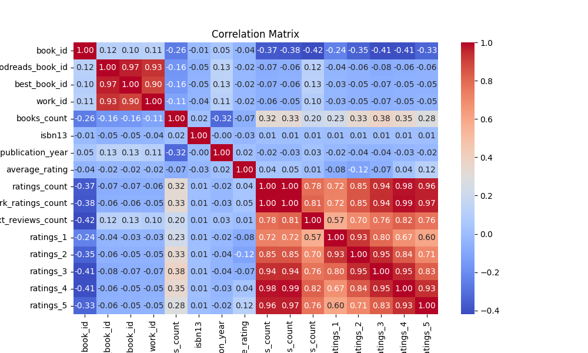
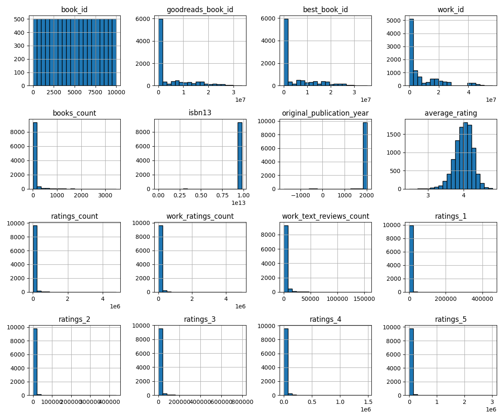

# Automated Analysis Report

## Dataset Overview
Number of rows: 10000
Number of columns: 23

## Column Summary
{
  "book_id": {
    "type": "int64",
    "num_missing": 0,
    "unique_values": 10000,
    "sample_values": [
      3216,
      6405,
      4593
    ]
  },
  "goodreads_book_id": {
    "type": "int64",
    "num_missing": 0,
    "unique_values": 10000,
    "sample_values": [
      17876,
      37338,
      10889279
    ]
  },
  "best_book_id": {
    "type": "int64",
    "num_missing": 0,
    "unique_values": 10000,
    "sample_values": [
      7646805,
      9670094,
      7967
    ]
  },
  "work_id": {
    "type": "int64",
    "num_missing": 0,
    "unique_values": 10000,
    "sample_values": [
      6727073,
      15568720,
      42386247
    ]
  },
  "books_count": {
    "type": "int64",
    "num_missing": 0,
    "unique_values": 597,
    "sample_values": [
      51,
      46,
      50
    ]
  },
  "isbn": {
    "type": "object",
    "num_missing": 700,
    "unique_values": 9300,
    "sample_values": [
      "439672465",
      "670016381",
      "1423134494"
    ]
  },
  "isbn13": {
    "type": "float64",
    "num_missing": 585,
    "unique_values": 9153,
    "sample_values": [
      9780399256190.0,
      9780553807140.0,
      9780810993140.0
    ]
  },
  "authors": {
    "type": "object",
    "num_missing": 0,
    "unique_values": 4664,
    "sample_values": [
      "Anthony Doerr",
      "Alexandra Adornetto",
      "Laura Joffe Numeroff, Felicia Bond"
    ]
  },
  "original_publication_year": {
    "type": "float64",
    "num_missing": 21,
    "unique_values": 293,
    "sample_values": [
      2014.0,
      2003.0,
      2003.0
    ]
  },
  "original_title": {
    "type": "object",
    "num_missing": 585,
    "unique_values": 9274,
    "sample_values": [
      "One Fish, Two Fish, Red Fish, Blue Fish",
      "September",
      "The Noticer: Sometimes, all a person needs is a little perspective."
    ]
  },
  "title": {
    "type": "object",
    "num_missing": 0,
    "unique_values": 9964,
    "sample_values": [
      "The Walking Dead, Vol. 03: Safety Behind Bars",
      "Dawn (Cutler, #1)",
      "The Ipcress File (Secret File, #1)"
    ]
  },
  "language_code": {
    "type": "object",
    "num_missing": 1084,
    "unique_values": 25,
    "sample_values": [
      "en-US",
      "eng",
      "eng"
    ]
  },
  "average_rating": {
    "type": "float64",
    "num_missing": 0,
    "unique_values": 184,
    "sample_values": [
      4.27,
      4.14,
      4.05
    ]
  },
  "ratings_count": {
    "type": "int64",
    "num_missing": 0,
    "unique_values": 9003,
    "sample_values": [
      13541,
      30415,
      123065
    ]
  },
  "work_ratings_count": {
    "type": "int64",
    "num_missing": 0,
    "unique_values": 9053,
    "sample_values": [
      15555,
      15473,
      25090
    ]
  },
  "work_text_reviews_count": {
    "type": "int64",
    "num_missing": 0,
    "unique_values": 4581,
    "sample_values": [
      4225,
      4483,
      3586
    ]
  },
  "ratings_1": {
    "type": "int64",
    "num_missing": 0,
    "unique_values": 2630,
    "sample_values": [
      520,
      398,
      437
    ]
  },
  "ratings_2": {
    "type": "int64",
    "num_missing": 0,
    "unique_values": 4117,
    "sample_values": [
      2560,
      641,
      257
    ]
  },
  "ratings_3": {
    "type": "int64",
    "num_missing": 0,
    "unique_values": 6972,
    "sample_values": [
      2468,
      5531,
      4856
    ]
  },
  "ratings_4": {
    "type": "int64",
    "num_missing": 0,
    "unique_values": 7762,
    "sample_values": [
      3967,
      5929,
      59629
    ]
  },
  "ratings_5": {
    "type": "int64",
    "num_missing": 0,
    "unique_values": 8103,
    "sample_values": [
      32492,
      20957,
      10520
    ]
  },
  "image_url": {
    "type": "object",
    "num_missing": 0,
    "unique_values": 6669,
    "sample_values": [
      "https://images.gr-assets.com/books/1426128094m/23245587.jpg",
      "https://s.gr-assets.com/assets/nophoto/book/111x148-bcc042a9c91a29c1d680899eff700a03.png",
      "https://images.gr-assets.com/books/1329749855m/12522507.jpg"
    ]
  },
  "small_image_url": {
    "type": "object",
    "num_missing": 0,
    "unique_values": 6669,
    "sample_values": [
      "https://images.gr-assets.com/books/1358353512s/9736930.jpg",
      "https://images.gr-assets.com/books/1298564680s/10433900.jpg",
      "https://s.gr-assets.com/assets/nophoto/book/50x75-a91bf249278a81aabab721ef782c4a74.png"
    ]
  }
}

## Summary Statistics
                             count unique                                                                                       top  freq                  mean                  std          min              25%              50%              75%              max
book_id                    10000.0    NaN                                                                                       NaN   NaN                5000.5           2886.89568          1.0          2500.75           5000.5          7500.25          10000.0
goodreads_book_id          10000.0    NaN                                                                                       NaN   NaN          5264696.5132        7575461.86359          1.0         46275.75         394965.5       9382225.25       33288638.0
best_book_id               10000.0    NaN                                                                                       NaN   NaN          5471213.5801        7827329.89072          1.0         47911.75         425123.5        9636112.5       35534230.0
work_id                    10000.0    NaN                                                                                       NaN   NaN          8646183.4246       11751060.82408         87.0        1008841.0        2719524.5      14517748.25       56399597.0
books_count                10000.0    NaN                                                                                       NaN   NaN               75.7127           170.470728          1.0             23.0             40.0             67.0           3455.0
isbn                          9300   9300                                                                                 375700455     1                   NaN                  NaN          NaN              NaN              NaN              NaN              NaN
isbn13                      9415.0    NaN                                                                                       NaN   NaN  9755044298883.462891  442861920665.573364  195170342.0  9780316192995.0  9780451528640.0  9780830777175.0  9790007672390.0
authors                      10000   4664                                                                              Stephen King    60                   NaN                  NaN          NaN              NaN              NaN              NaN              NaN
original_publication_year   9979.0    NaN                                                                                       NaN   NaN           1981.987674           152.576665      -1750.0           1990.0           2004.0           2011.0           2017.0
original_title                9415   9274                                                                                               5                   NaN                  NaN          NaN              NaN              NaN              NaN              NaN
title                        10000   9964                                                                            Selected Poems     4                   NaN                  NaN          NaN              NaN              NaN              NaN              NaN
language_code                 8916     25                                                                                       eng  6341                   NaN                  NaN          NaN              NaN              NaN              NaN              NaN
average_rating             10000.0    NaN                                                                                       NaN   NaN              4.002191             0.254427         2.47             3.85             4.02             4.18             4.82
ratings_count              10000.0    NaN                                                                                       NaN   NaN            54001.2351        157369.956436       2716.0         13568.75          21155.5          41053.5        4780653.0
work_ratings_count         10000.0    NaN                                                                                       NaN   NaN            59687.3216        167803.785237       5510.0         15438.75          23832.5          45915.0        4942365.0
work_text_reviews_count    10000.0    NaN                                                                                       NaN   NaN             2919.9553          6124.378132          3.0            694.0           1402.0          2744.25         155254.0
ratings_1                  10000.0    NaN                                                                                       NaN   NaN             1345.0406          6635.626263         11.0            196.0            391.0            885.0         456191.0
ratings_2                  10000.0    NaN                                                                                       NaN   NaN              3110.885          9717.123578         30.0            656.0           1163.0          2353.25         436802.0
ratings_3                  10000.0    NaN                                                                                       NaN   NaN            11475.8938         28546.449183        323.0           3112.0           4894.0           9287.0         793319.0
ratings_4                  10000.0    NaN                                                                                       NaN   NaN            19965.6966         51447.358384        750.0          5405.75           8269.5          16023.5        1481305.0
ratings_5                  10000.0    NaN                                                                                       NaN   NaN            23789.8056         79768.885611        754.0           5334.0           8836.0          17304.5        3011543.0
image_url                    10000   6669  https://s.gr-assets.com/assets/nophoto/book/111x148-bcc042a9c91a29c1d680899eff700a03.png  3332                   NaN                  NaN          NaN              NaN              NaN              NaN              NaN
small_image_url              10000   6669    https://s.gr-assets.com/assets/nophoto/book/50x75-a91bf249278a81aabab721ef782c4a74.png  3332                   NaN                  NaN          NaN              NaN              NaN              NaN              NaN

## Correlation Matrix
                            book_id  goodreads_book_id  best_book_id   work_id  books_count    isbn13  original_publication_year  average_rating  ratings_count  work_ratings_count  work_text_reviews_count  ratings_1  ratings_2  ratings_3  ratings_4  ratings_5
book_id                    1.000000           0.115154      0.104516  0.113861    -0.263841 -0.011291                   0.049875       -0.040880      -0.373178           -0.382656                -0.419292  -0.239401  -0.345764  -0.413279  -0.407079  -0.332486
goodreads_book_id          0.115154           1.000000      0.966620  0.929356    -0.164578 -0.048246                   0.133790       -0.024848      -0.073023           -0.063760                 0.118845  -0.038375  -0.056571  -0.075634  -0.063310  -0.056145
best_book_id               0.104516           0.966620      1.000000  0.899258    -0.159240 -0.047253                   0.131442       -0.021187      -0.069182           -0.055835                 0.125893  -0.033894  -0.049284  -0.067014  -0.054462  -0.049524
work_id                    0.113861           0.929356      0.899258  1.000000    -0.109436 -0.039320                   0.107972       -0.017555      -0.062720           -0.054712                 0.096985  -0.034590  -0.051367  -0.066746  -0.054775  -0.046745
books_count               -0.263841          -0.164578     -0.159240 -0.109436     1.000000  0.017865                  -0.321753       -0.069888       0.324235            0.333664                 0.198698   0.225763   0.334923   0.383699   0.349564   0.279559
isbn13                    -0.011291          -0.048246     -0.047253 -0.039320     0.017865  1.000000                  -0.004612       -0.025667       0.008904            0.009166                 0.009553   0.006054   0.010345   0.012142   0.010161   0.006622
original_publication_year  0.049875           0.133790      0.131442  0.107972    -0.321753 -0.004612                   1.000000        0.015608      -0.024415           -0.025448                 0.027784  -0.019635  -0.038472  -0.042459  -0.025785  -0.015388
average_rating            -0.040880          -0.024848     -0.021187 -0.017555    -0.069888 -0.025667                   0.015608        1.000000       0.044990            0.045042                 0.007481  -0.077997  -0.115875  -0.065237   0.036108   0.115412
ratings_count             -0.373178          -0.073023     -0.069182 -0.062720     0.324235  0.008904                  -0.024415        0.044990       1.000000            0.995068                 0.779635   0.723144   0.845949   0.935193   0.978869   0.964046
work_ratings_count        -0.382656          -0.063760     -0.055835 -0.054712     0.333664  0.009166                  -0.025448        0.045042       0.995068            1.000000                 0.807009   0.718718   0.848581   0.941182   0.987764   0.966587
work_text_reviews_count   -0.419292           0.118845      0.125893  0.096985     0.198698  0.009553                   0.027784        0.007481       0.779635            0.807009                 1.000000   0.572007   0.696880   0.762214   0.817826   0.764940
ratings_1                 -0.239401          -0.038375     -0.033894 -0.034590     0.225763  0.006054                  -0.019635       -0.077997       0.723144            0.718718                 0.572007   1.000000   0.926140   0.795364   0.672986   0.597231
ratings_2                 -0.345764          -0.056571     -0.049284 -0.051367     0.334923  0.010345                  -0.038472       -0.115875       0.845949            0.848581                 0.696880   0.926140   1.000000   0.949596   0.838298   0.705747
ratings_3                 -0.413279          -0.075634     -0.067014 -0.066746     0.383699  0.012142                  -0.042459       -0.065237       0.935193            0.941182                 0.762214   0.795364   0.949596   1.000000   0.952998   0.825550
ratings_4                 -0.407079          -0.063310     -0.054462 -0.054775     0.349564  0.010161                  -0.025785        0.036108       0.978869            0.987764                 0.817826   0.672986   0.838298   0.952998   1.000000   0.933785
ratings_5                 -0.332486          -0.056145     -0.049524 -0.046745     0.279559  0.006622                  -0.015388        0.115412       0.964046            0.966587                 0.764940   0.597231   0.705747   0.825550   0.933785   1.000000

## Outlier Detection
{
  "book_id": 0,
  "goodreads_book_id": 345,
  "best_book_id": 357,
  "work_id": 601,
  "books_count": 844,
  "isbn13": 556,
  "original_publication_year": 1031,
  "average_rating": 158,
  "ratings_count": 1163,
  "work_ratings_count": 1143,
  "work_text_reviews_count": 1005,
  "ratings_1": 1140,
  "ratings_2": 1156,
  "ratings_3": 1149,
  "ratings_4": 1131,
  "ratings_5": 1158
}

## Insights from LLM
Based on the dataset summary and statistics provided, several analyses and insights can be drawn. Here are some suggestions:

### 1. Missing Data Analysis
- **ISBN Columns**: Analyze the impact of missing values in the `isbn` and `isbn13` columns on the overall dataset. Determine if the missing values affect any correlations or metrics.
- **Original Publication Year**: Investigate the influence of the missing `original_publication_year` on average ratings and reviews.

### 2. Exploratory Data Analysis (EDA)
- **Distribution of Ratings**: Visualize the distribution of the different rating categories (`ratings_1` to `ratings_5`) to understand the rating behaviors of users.
- **Average Rating vs. Ratings Count**: Plot the average rating against the number of ratings to identify patterns. A scatter plot might reveal if more rated books have significantly higher or lower average ratings.
- **Publication Year Trend**: Analyze the trend in average ratings over the years. This might show if newer books receive better or worse ratings compared to older ones.

### 3. Author Analysis
- **Top Authors**: Identify the top-rated authors based on average rating and the count of ratings. This can help to understand which authors are consistently well-received by readers.
- **Collaborative Works**: Examine books with multiple authors (as seen in sample values for `authors`) to see how collaboration influences ratings.

### 4. Linguistic Analysis
- **Language Code Insights**: Investigate how books in different languages are rated on average. This could provide insights into cultural preferences and possibly translation challenges.
- **Most Common Languages**: Identify the most common languages in the dataset and analyze their respective distributions of average ratings.

### 5. Correlation Analysis
- **Correlation Discovery**: Dive deeper into the correlation matrix, especially focusing on negative correlations and their potential implications (e.g., how the `ratings_count` correlates with ratings in the 1-5 scale).
- **Impact of Book Count**: Analyze how `books_count` affects the ratings and reviews as indicated by its correlation (especially negative correlation with average rating).

### 6. Comparative Analysis
- **Best vs. Average Performing Books**: Segment books into top performers (high average ratings and high ratings count) vs. average performers. Compare their attributes like `books_count`, `original_publication_year`, etc.
- **Visual Comparisons**: Use box plots or violin plots to visually compare key attributes between top-rated and average-rated books.

### 7. Time Series Analysis
- **Publication Year Trends**: Consider how the average rating has changed over time or publication years. This could reveal trends in reader preferences and publishing quality.
- **Book Rarity**: Analyze whether books with lower counts (from `books_count`) have any impact on ratings. Are rarer titles more highly rated in a niche community?

### 8. Predictive Modeling
- **Predicting Ratings**: Use features such as `books_count`, `average_rating`, `work_text_reviews_count`, etc., to build a predictive model to estimate a book's rating based on its characteristics.
- **Clustering Analysis**: Apply clustering methods (like K-Means) to segment books based on similar attributes to see if trends emerge in certain clusters.

### 9. Recommendation System
- **Collaborative Filtering**: Utilize ratings data to develop a recommendation system identifying books that users might enjoy based on similarities in ratings patterns.
- **Content-Based Recommendations**: Explore methods for recommending books based on attributes like author, title themes, and publication year.

### 10. Visualization
- **Create Interactive Dashboards**: Employ visual analysis tools (like Tableau or Power BI) to create interactive dashboards that provide real-time insights and facilitate further investigations by users.

By pursuing some of these analyses, one can derive rich insights into the data, understand reader preferences better, and leverage that to make informed decisions regarding book publishing, marketing, and reader engagement strategies.

## Visualizations

