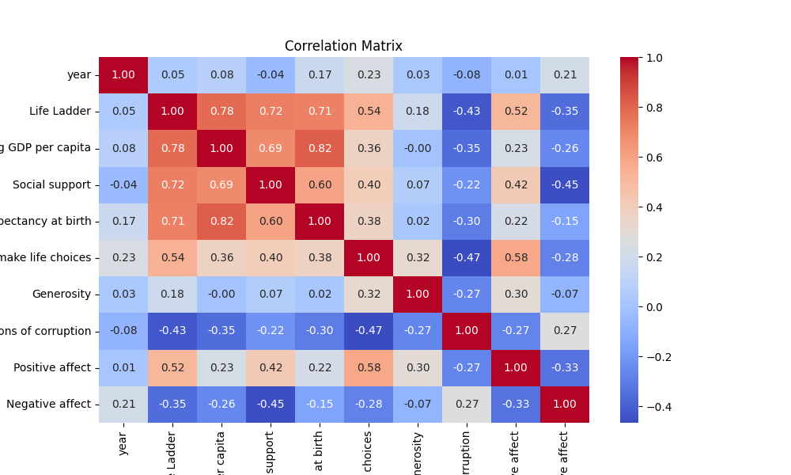
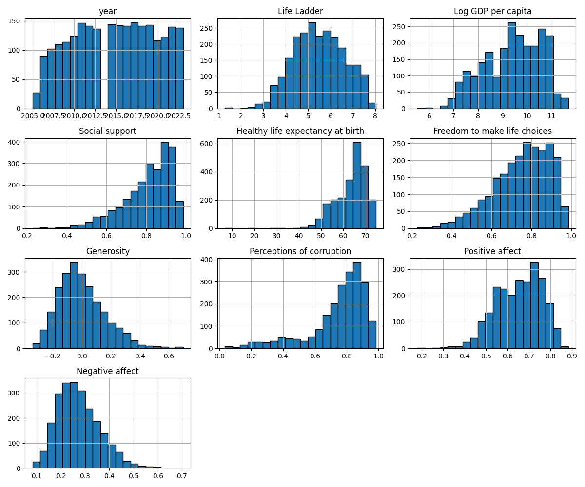

# Automated Analysis Report

## Dataset Overview
Number of rows: 2363
Number of columns: 11

## Column Summary
{
  "Country name": {
    "type": "object",
    "num_missing": 0,
    "unique_values": 165,
    "sample_values": [
      "Chile",
      "Armenia",
      "Argentina"
    ]
  },
  "year": {
    "type": "int64",
    "num_missing": 0,
    "unique_values": 19,
    "sample_values": [
      2019,
      2016,
      2020
    ]
  },
  "Life Ladder": {
    "type": "float64",
    "num_missing": 0,
    "unique_values": 1814,
    "sample_values": [
      4.9,
      7.498,
      4.575
    ]
  },
  "Log GDP per capita": {
    "type": "float64",
    "num_missing": 28,
    "unique_values": 1760,
    "sample_values": [
      8.656,
      10.845,
      9.374
    ]
  },
  "Social support": {
    "type": "float64",
    "num_missing": 13,
    "unique_values": 484,
    "sample_values": [
      0.921,
      0.776,
      0.866
    ]
  },
  "Healthy life expectancy at birth": {
    "type": "float64",
    "num_missing": 63,
    "unique_values": 1126,
    "sample_values": [
      68.72,
      55.62,
      54.075
    ]
  },
  "Freedom to make life choices": {
    "type": "float64",
    "num_missing": 36,
    "unique_values": 550,
    "sample_values": [
      0.744,
      0.752,
      0.663
    ]
  },
  "Generosity": {
    "type": "float64",
    "num_missing": 81,
    "unique_values": 650,
    "sample_values": [
      -0.016,
      -0.176,
      -0.259
    ]
  },
  "Perceptions of corruption": {
    "type": "float64",
    "num_missing": 125,
    "unique_values": 613,
    "sample_values": [
      0.945,
      0.099,
      0.781
    ]
  },
  "Positive affect": {
    "type": "float64",
    "num_missing": 24,
    "unique_values": 442,
    "sample_values": [
      0.733,
      0.648,
      0.6
    ]
  },
  "Negative affect": {
    "type": "float64",
    "num_missing": 16,
    "unique_values": 394,
    "sample_values": [
      0.322,
      0.28,
      0.177
    ]
  }
}

## Summary Statistics
                                   count unique        top freq        mean       std     min     25%     50%      75%     max
Country name                        2363    165  Argentina   18         NaN       NaN     NaN     NaN     NaN      NaN     NaN
year                              2363.0    NaN        NaN  NaN  2014.76386  5.059436  2005.0  2011.0  2015.0   2019.0  2023.0
Life Ladder                       2363.0    NaN        NaN  NaN    5.483566  1.125522   1.281   4.647   5.449   6.3235   8.019
Log GDP per capita                2335.0    NaN        NaN  NaN    9.399671  1.152069   5.527  8.5065   9.503  10.3925  11.676
Social support                    2350.0    NaN        NaN  NaN    0.809369  0.121212   0.228   0.744  0.8345    0.904   0.987
Healthy life expectancy at birth  2300.0    NaN        NaN  NaN   63.401828  6.842644    6.72  59.195    65.1  68.5525    74.6
Freedom to make life choices      2327.0    NaN        NaN  NaN    0.750282  0.139357   0.228   0.661   0.771    0.862   0.985
Generosity                        2282.0    NaN        NaN  NaN    0.000098  0.161388   -0.34  -0.112  -0.022  0.09375     0.7
Perceptions of corruption         2238.0    NaN        NaN  NaN    0.743971  0.184865   0.035   0.687  0.7985  0.86775   0.983
Positive affect                   2339.0    NaN        NaN  NaN    0.651882   0.10624   0.179   0.572   0.663    0.737   0.884
Negative affect                   2347.0    NaN        NaN  NaN    0.273151  0.087131   0.083   0.209   0.262    0.326   0.705

## Correlation Matrix
                                      year  Life Ladder  Log GDP per capita  Social support  Healthy life expectancy at birth  Freedom to make life choices  Generosity  Perceptions of corruption  Positive affect  Negative affect
year                              1.000000     0.046846            0.080104       -0.043074                          0.168026                      0.232974    0.030864                  -0.082136         0.013052         0.207642
Life Ladder                       0.046846     1.000000            0.783556        0.722738                          0.714927                      0.538210    0.177398                  -0.430485         0.515283        -0.352412
Log GDP per capita                0.080104     0.783556            1.000000        0.685329                          0.819326                      0.364816   -0.000766                  -0.353893         0.230868        -0.260689
Social support                   -0.043074     0.722738            0.685329        1.000000                          0.597787                      0.404131    0.065240                  -0.221410         0.424524        -0.454878
Healthy life expectancy at birth  0.168026     0.714927            0.819326        0.597787                          1.000000                      0.375745    0.015168                  -0.303130         0.217982        -0.150330
Freedom to make life choices      0.232974     0.538210            0.364816        0.404131                          0.375745                      1.000000    0.321396                  -0.466023         0.578398        -0.278959
Generosity                        0.030864     0.177398           -0.000766        0.065240                          0.015168                      0.321396    1.000000                  -0.270004         0.300608        -0.071975
Perceptions of corruption        -0.082136    -0.430485           -0.353893       -0.221410                         -0.303130                     -0.466023   -0.270004                   1.000000        -0.274208         0.265555
Positive affect                   0.013052     0.515283            0.230868        0.424524                          0.217982                      0.578398    0.300608                  -0.274208         1.000000        -0.334451
Negative affect                   0.207642    -0.352412           -0.260689       -0.454878                         -0.150330                     -0.278959   -0.071975                   0.265555        -0.334451         1.000000

## Outlier Detection
{
  "year": 0,
  "Life Ladder": 2,
  "Log GDP per capita": 1,
  "Social support": 48,
  "Healthy life expectancy at birth": 20,
  "Freedom to make life choices": 16,
  "Generosity": 39,
  "Perceptions of corruption": 194,
  "Positive affect": 9,
  "Negative affect": 31
}

## Insights from LLM
Based on the provided dataset summary, statistical descriptions, and correlation matrix, here are several suggestions for further analyses and insights:

### 1. **Missing Data Analysis**
   - **Investigate Patterns of Missingness**: Examine the columns with missing data (e.g., `Log GDP per capita`, `Social support`, `Healthy life expectancy at birth`, etc.) to see if there's a pattern in the missingness, for instance, by year or country.
   - **Imputation Techniques**: Consider imputing missing values using various techniques such as mean/mode imputation, K-Nearest Neighbors, or advanced techniques like multiple imputation.

### 2. **Trends Over Time**
   - **Time Series Analysis**: Analyze and visualize how key indicators (e.g., `Life Ladder`, `Log GDP per capita`, `Social support`) have changed over the years across different countries. This can be done using line plots or area charts.
   - **Year-on-Year Growth**: Calculate the year-on-year growth rates for economic and social indicators (like `Log GDP per capita` and `Life Ladder`) to assess improvements or deteriorations.

### 3. **Country Comparison**
   - **Top Performers vs. Bottom Performers**: Identify the countries with the highest and lowest scores in important columns like `Life Ladder` and `Healthy life expectancy at birth` and analyze their socio-economic attributes (like `Log GDP per capita`, `Social support`, etc.).
   - **Grouping Analysis**: Group countries based on their performance in specific metrics (e.g., clusters of countries with high `Life Ladder` scores) and examine what factors contribute to these groupings.

### 4. **Correlation Analysis**
   - **Strongest Correlations**: Examine the factors that have strong positive or negative correlations with `Life Ladder`. For example, `Log GDP per capita` and `Social support` show high correlations, suggesting that economic prosperity and social structures may positively influence well-being. Investigate this relationship deeper with regression analysis.
   - **Multivariate Regression Models**: Perform regression analyses to identify how well other factors (e.g., `Log GDP per capita`, `Social support`, `Healthy life expectancy at birth`) predict `Life Ladder`. This can yield insights about what contributes most to life satisfaction in different contexts.

### 5. **Impact of Perceptions and Support Measures**
   - **Social Support vs. Perceptions of Corruption**: Given the negative correlation between `Social support` and `Perceptions of corruption`, it could be insightful to analyze how perceptions of corruption affect social support and overall quality of life.
   - **Positive vs. Negative Affect**: Investigate how the balance between positive and negative affect influences `Life Ladder` scores. This could involve exploring the psychological impacts of social structures and policies.

### 6. **Segment Analysis**
   - **Economic Segmentation**: Categorize countries into different economic segments (low, middle, high income) and examine how their indicators differ, particularly focusing on `Log GDP per capita`, `Generosity`, and `Perceptions of corruption`.
   - **Demographic Insights**: If demographic data is available, analyze how different demographics influence the well-being metrics across various countries.

### 7. **Comparative Analysis**
   - **Cross-Region Comparison**: Investigate differences between regions (e.g., Europe vs. Latin America) to understand geographic influences on well-being metrics.
   - **Global vs. Regional Trends**: Compare global trends to regional trends to see where regions may be diverging from global averages (i.e., are certain indicators improving or declining faster in specific regions?).

### 8. **Visualization**
   - **Heatmaps and Correlation Plots**: Create visualizations such as heatmaps to show correlation between all metrics, making it easy to spot correlations.
   - **Interactive Dashboards**: Consider building interactive dashboards using tools like Tableau or Power BI to allow stakeholders to visualize data and trends at their convenience.

These analyses and insights will provide a comprehensive understanding of the factors influencing life satisfaction across different countries while highlighting potential areas for policy intervention and support improvements.

## Visualizations

