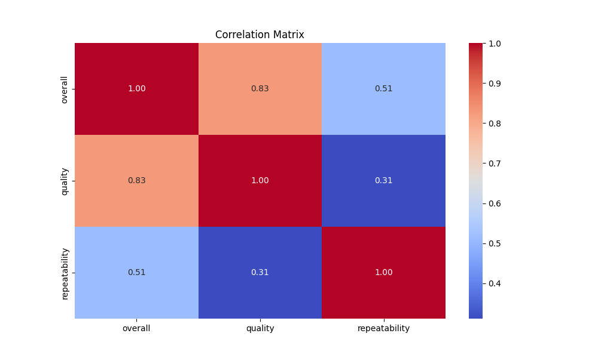
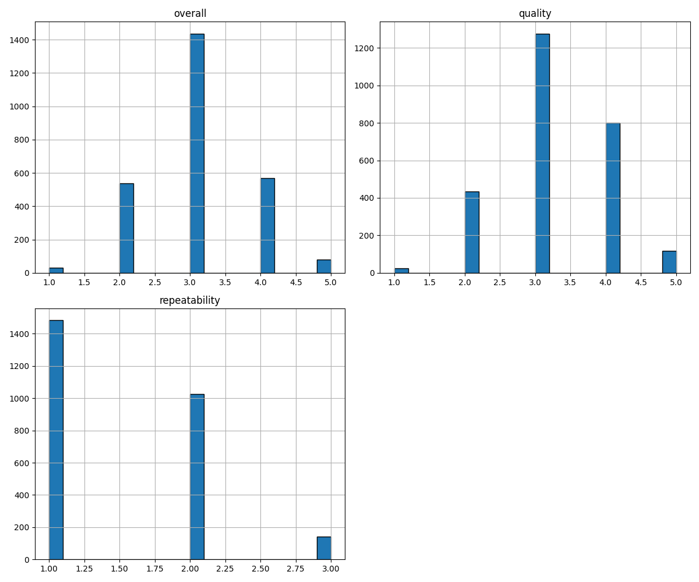

# Automated Analysis Report

## Dataset Overview
- **Number of rows**: 2652
- **Number of columns**: 8

## Column Summary
| Column Name | Data Type | Missing Values | Unique Values | Sample Values |
|-------------|-----------|----------------|---------------|---------------|
| date | object | 99 | 2055 | ['29-Jun-06', '30-Jul-18', '02-Jun-10'] |
| language | object | 0 | 11 | ['English', 'English', 'Tamil'] |
| type | object | 0 | 8 | ['movie', 'fiction', 'movie'] |
| title | object | 0 | 2312 | ['Arunachalam', 'Ab Tak Chappan', 'Khoobsurat'] |
| by | object | 262 | 1528 | ['Mahesh Babu, Trisha', 'Nani, Sampath, Mehreen Pirzada', 'Nagarjuna, Anushka Shetty'] |
| overall | int64 | 0 | 5 | [4, 3, 3] |
| quality | int64 | 0 | 5 | [2, 4, 2] |
| repeatability | int64 | 0 | 3 | [1, 2, 3] |

## Summary Statistics
|               |   count |   unique | top               |   freq |      mean |        std |   min |   25% |   50% |   75% |   max |
|:--------------|--------:|---------:|:------------------|-------:|----------:|-----------:|------:|------:|------:|------:|------:|
| date          |    2553 |     2055 | 21-May-06         |      8 | nan       | nan        |   nan |   nan |   nan |   nan |   nan |
| language      |    2652 |       11 | English           |   1306 | nan       | nan        |   nan |   nan |   nan |   nan |   nan |
| type          |    2652 |        8 | movie             |   2211 | nan       | nan        |   nan |   nan |   nan |   nan |   nan |
| title         |    2652 |     2312 | Kanda Naal Mudhal |      9 | nan       | nan        |   nan |   nan |   nan |   nan |   nan |
| by            |    2390 |     1528 | Kiefer Sutherland |     48 | nan       | nan        |   nan |   nan |   nan |   nan |   nan |
| overall       |    2652 |      nan | nan               |    nan |   3.04751 |   0.76218  |     1 |     3 |     3 |     3 |     5 |
| quality       |    2652 |      nan | nan               |    nan |   3.20928 |   0.796743 |     1 |     3 |     3 |     4 |     5 |
| repeatability |    2652 |      nan | nan               |    nan |   1.49472 |   0.598289 |     1 |     1 |     1 |     2 |     3 |

## Correlation Matrix
|               |   overall |   quality |   repeatability |
|:--------------|----------:|----------:|----------------:|
| overall       |  1        |  0.825935 |        0.5126   |
| quality       |  0.825935 |  1        |        0.312127 |
| repeatability |  0.5126   |  0.312127 |        1        |

## Outlier Detection
| Column Name | Outlier Count |
|-------------|---------------|
| overall | 1216 |
| quality | 24 |
| repeatability | 0 |

## Insights from LLM
Based on the provided dataset summary and statistics, here are some suggestions for further analyses and insights:

### 1. **Handling Missing Data:**
   - **Assess Missing Values:** Investigate the 99 missing values in the `date` column and 262 missing values in the `by` column. Consider filling these gaps using suitable imputation techniques or analyzing the impact of these missing values on key outcomes.
   - **Impact of Missing Data:** Assess how excluding rows with missing values in the `date` or `by` columns affects the overall statistics and insights.
  
### 2. **Date Analysis:**
   - **Trend Analysis:** Examine the trend of ratings (overall, quality, and repeatability) over time. Group data by year or month to evaluate if there is any observable trend in the data.
   - **Seasonality:** Analyze if certain types or languages are more popular in specific months or seasons.

### 3. **Language Insights:**
   - **Performance by Language:** Compare the average ratings (overall, quality, repeatability) across different languages. This could highlight which languages have the highest-rated content.
   - **Distribution of Languages:** Analyze the proportion of different languages in the dataset to understand representation better.

### 4. **Type Analysis:**
   - **Performance by Type:** Investigate if certain types (e.g., movie, fiction) perform better overall in terms of ratings. 
   - **Correlation with Language:** Explore the interaction between `type` and `language` to see if specific types are more prevalent in certain languages and how they impact ratings.

### 5. **Title and Author Analysis:**
   - **Frequent Titles and Creators:** Identify titles and creators (`by`) with the highest frequency in the dataset, and evaluate their average ratings.
   - **Unique Contributions:** Explore the diversity of ratings among titles produced by the same creator. This can indicate whether some creators consistently perform well or if there is variability.

### 6. **Rating Correlations:**
   - **Deeper Dive into Correlations:** Explore the interrelationships among overall ratings, quality, and repeatability further. For instance, how repeatability affects the quality or overall ratings.
   - **Predictive Modeling:** Consider building a regression model to predict overall ratings based on quality and repeatability, as there is a strong correlation.

### 7. **Quality and Repeatability Analysis:**
   - **Performance Distribution:** Create box plots or histograms for quality and repeatability scores to visualize their distribution and identify any outliers.
   - **Categorical Analysis:** Examine if high quality correlates with higher repeatability ratings, suggesting that higher quality content tends to be more favored.

### 8. **Comparative Analysis:**
   - **Overall Ratings by Gender Representation:** If additional data on gender representation in movies or shows (e.g., presence of female directors or leads) is available, compare their ratings against overall trends.
   - **Genre-Specific Analysis:** If genre classification is available or can be inferred, compare performance metrics across genres.

### 9. **Visualization:**
   - Visualizations such as heatmaps for correlations, time series plots for trends over time, and bar charts for categorical comparisons can provide clearer insights into the data.

### 10. **Dimensionality Reduction:**
   - If applicable, use techniques like PCA (Principal Component Analysis) to explore if there are underlying patterns or groupings in the dataset based on the ratings and categories.

By implementing these analyses, you can unveil deeper insights into the factors influencing ratings and the distribution of content in the dataset, enabling you to draw conclusions that could inform decision-making or further research.

## Visualizations

